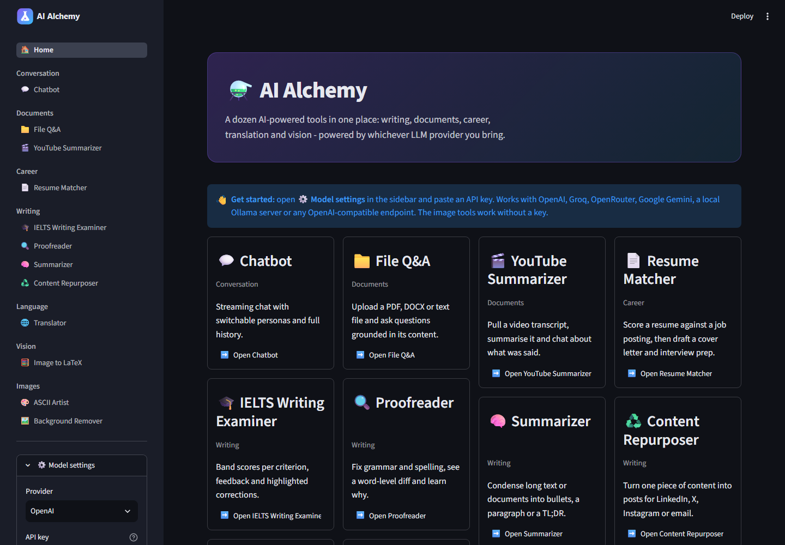
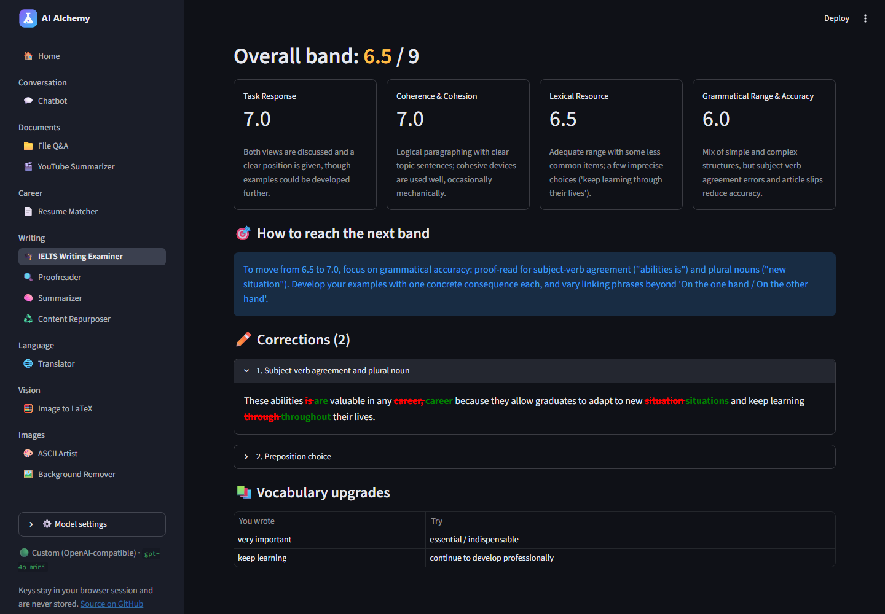

<div align="center">


**Twelve AI-powered tools in one Streamlit app - bring any LLM provider.**

[](https://github.com/hiraddlz/ai-alchemy/actions/workflows/ci.yml)
[](pyproject.toml)
[](https://streamlit.io)
[](https://github.com/astral-sh/ruff)
[](LICENSE)

[**Live demo**](https://ai-alchemy.streamlit.app/) · [Tools](#tools) · [Quick start](#quick-start) · [Architecture](#architecture) · [Development](#development)



</div>

## What it is

AI Alchemy is a single, self-hostable web app that packages everyday LLM workflows - proofreading,
summarising, document Q&A, resume tailoring, IELTS grading, translation, equation OCR - behind a
clean UI. It is **provider-agnostic**: every tool talks to the model through the OpenAI-compatible
chat API, so you can run it on OpenAI, Groq, OpenRouter, Google Gemini, a local Ollama server or any
compatible endpoint by changing a dropdown. Keys live only in your browser session.

Highlights:

- **Structured outputs, not just chat.** Grading and matching tools request JSON, validate it, and
  render it as metrics, badges, tables and word-level diffs.
- **Vision where it helps.** Equation-to-LaTeX and handwriting OCR use the model's vision input
  instead of shipping a 2 GB `torch` + `pix2tex` stack.
- **Streaming everywhere.** Long outputs render token by token.
- **Tested.** Pure helpers are unit-tested; every page is exercised end-to-end with Streamlit's
  `AppTest` against a fake OpenAI-compatible server (no network, no keys).
- **Deployable in one command** - Streamlit Cloud, Docker, or `streamlit run app.py`.

## Tools

| Tool | What it does |
| --- | --- |
| 💬 **Chatbot** | Streaming chat with switchable personas and full history |
| 📁 **File Q&A** | Upload PDF / DOCX / TXT / MD and ask grounded questions; suggested prompts |
| 🎬 **YouTube Summarizer** | Transcript → TL;DR + key points + quotes, then chat about the video |
| 📄 **Resume Matcher** | 0-100 fit score, strengths, gaps, keyword coverage, rewritten summary, phrase-level diffs, cover letter and interview prep |
| 🎓 **IELTS Writing Examiner** | Band per criterion, next-band advice, corrections with diffs, vocabulary upgrades; accepts a photo of handwriting |
| 🔍 **Proofreader** | Fix / tighten / formalise, word-level diff, and an explanation of each change |
| 🧠 **Summarizer** | Bullets, paragraph, TL;DR or executive brief; text or document input; output language |
| ♻️ **Content Repurposer** | One source → LinkedIn post, X thread, Instagram caption, newsletter, blog intro |
| 🌐 **Translator** | 20+ languages, register control, right-to-left rendering for Persian/Arabic/Urdu/Hebrew |
| 🧮 **Image to LaTeX** | Photograph an equation, get compilable LaTeX rendered live |
| 🎨 **ASCII Artist** | Image → ASCII with tunable width, charset, brightness and contrast (no key needed) |
| 🖼️ **Background Remover** | Local U²-Net background removal via `rembg` (no key needed) |

<div align="center">

<br><sup>IELTS Writing Examiner: structured JSON from the model rendered as per-criterion scores and highlighted corrections.</sup>
</div>

## Quick start

```bash
git clone https://github.com/hiraddlz/ai-alchemy.git
cd ai-alchemy
python -m venv .venv && source .venv/bin/activate   # Windows: .venv\Scripts\activate
pip install -e ".[images]"        # drop [images] to skip the background remover
streamlit run app.py
```

Open http://localhost:8501, expand **⚙️ Model settings** in the sidebar, choose a provider and paste
a key. Free tiers exist for [Groq](https://console.groq.com/keys),
[OpenRouter](https://openrouter.ai/keys) and [Google AI Studio](https://aistudio.google.com/apikey);
[Ollama](https://ollama.com) needs no key at all.

To pre-configure a key instead of typing it each session, copy
[`.streamlit/secrets.toml.example`](.streamlit/secrets.toml.example) to `.streamlit/secrets.toml`
or set environment variables:

| Variable | Meaning | Default |
| --- | --- | --- |
| `LLM_PROVIDER` | `openai`, `groq`, `openrouter`, `gemini`, `ollama`, `custom` | `openai` |
| `LLM_API_KEY` | API key (`OPENAI_API_KEY` is also honoured for OpenAI) | - |
| `LLM_MODEL` | Model name | provider default |
| `LLM_BASE_URL` | Endpoint URL, only needed for `custom` | provider preset |

### Docker

```bash
docker build -t ai-alchemy .
docker run -p 8501:8501 -e LLM_PROVIDER=groq -e LLM_API_KEY=gsk_... ai-alchemy
```

### Streamlit Community Cloud

Point a new app at `app.py`, paste the contents of `secrets.toml.example` (with your key) into the
app's *Secrets* box, and deploy. `requirements.txt` is kept in sync with `pyproject.toml` for this.

## Architecture

```
app.py                     entry point: page config, st.navigation, sidebar settings
ai_alchemy/
├── config.py              provider presets + settings resolution (session > secrets > env)
├── llm.py                 LLMClient: chat / stream / JSON / vision on the OpenAI-compatible API
├── registry.py            single list of tools that drives navigation and the home page
├── ui.py                  shared widgets: settings sidebar, require_client(), streaming helpers
├── tools/                 pure, framework-free helpers (unit tested)
│   ├── ascii_art.py       image → ASCII
│   ├── documents.py       PDF / DOCX / TXT extraction, truncation
│   ├── youtube.py         URL parsing (watch, youtu.be, shorts, embed, live) + transcripts
│   └── diff.py            word-level redline diffs
└── pages/                 one module per tool, each exposing render()
tests/
├── conftest.py            FakeOpenAIServer: canned JSON + SSE streaming replies
├── test_tools.py          unit tests for helpers
├── test_llm.py            settings resolution, JSON parsing, client error mapping
└── test_pages.py          AppTest end-to-end runs of every page
```

Design notes:

- **One client, many providers.** `LLMClient` wraps the official `openai` SDK with a `base_url`.
  Provider quirks (e.g. no JSON mode on Ollama) live in a preset table, not in the tools.
- **Structured output is defensive.** `complete_json()` asks for JSON mode where supported, strips
  code fences, trims prose, repairs trailing commas and retries once before surfacing an error.
- **Errors are user-facing.** SDK exceptions are mapped to plain-language messages ("rejected the
  API key", "model not found", "rate limit") and rendered inline instead of crashing the page.
- **Pages are thin.** Prompts and layout live in the page; anything testable without Streamlit lives
  in `ai_alchemy/tools`.

## Development

```bash
pip install -e ".[dev,images]"
pre-commit install          # ruff lint + format on commit
pytest                      # ~60 tests, no network required
ruff check . && ruff format --check .
```

CI runs lint, the test matrix (3.10 / 3.12 / 3.13) and a Docker build on every push and PR.

### Adding a tool

1. Create `ai_alchemy/pages/<slug>.py` with a `render()` function. Use `require_client()` for the
   model and `stream_to_ui()` / `complete_json()` for output.
2. Add a `Tool(...)` entry to `ai_alchemy/registry.py` - navigation and the home page update
   automatically.
3. Put any non-UI logic in `ai_alchemy/tools/` and add a test.

## License

[MIT](LICENSE) © Hirad Dolatzadeh
